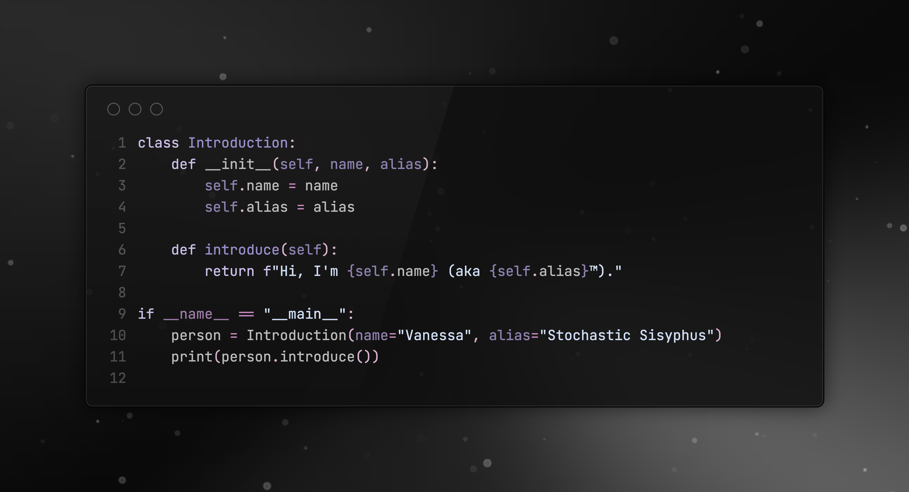

# MSBA

----
Portfolio adjacent. This is a collection of data analysis and data science, statistical methods, machine learning, deep learning, and other topics. I am fascinated with translating abstract ideas into tangible solutions and am particularly interested in the intersection of technology and practical applications. The majority are personal projects or from undergrad and grad school.



## Skills and Technologies

- **Programming Languages:** Python, R, SQL
- **Data Analysis Tools:** Jupyter Notebook, RStudio
- **Machine Learning Libraries:** TensorFlow, PyTorch, scikit-learn
- **Database Management:** PostgreSQL, MySQL, MongoDB
- **Cloud Platforms:** Google Cloud Platform (GCP), Amazon Web Services (AWS)
- **Development Tools:** Docker, VS Code
- **Other Tools:** Git, Firebase, Tableau

## Quick Links

- [Highlights](#highlights)
- [Repository Structure](#repository-structure)
- [Project Breakdown](#project-breakdown)
- [About Me](#about-me)

---

## Highlights

- [Advanced Data Processing Pipeline](https://github.com/stochastic-sisyphus/Portfolio/tree/main/advanced_data_processing_pipeline)
- [AI-Powered Research Synthesizer](https://github.com/stochastic-sisyphus/Portfolio/tree/main/AI-Research-Synthesizer)
- [Web Summarizer](https://github.com/stochastic-sisyphus/Portfolio/tree/main/Web%20Summarizer)
- [GitHub Repo Analyzer](https://github.com/stochastic-sisyphus/Portfolio/tree/main/github-repo-analyzer)
- [WebWeave](https://github.com/stochastic-sisyphus/Portfolio/tree/main/WebWeave)

---

## Repository Structure

```plaintext
Portfolio/
├── ML_Basics_with_Backpropagation_and_Gradient_Descent.ipynb
├── Log_Reg_CIFAR10_Analysis.ipynb
├── SSSourceCode.png
├── DeepLearningLangProj_NormalizationTranslation.ipynb
├── Language_Modeling_Text_Analytics.ipynb
├── Language_Modeling_Project.txt
├── README.md
├── nltk_senses_embeddings.ipynb
├── LSTM_Text_Modeling.ipynb
├── Web Summarizer/
│   ├── url_summarizer.py
│   └── README.md
├── Web Scraping/
│   ├── PSID_Data_Scraping_Automation.py
│   └── PSID_Automatic_Data_Retrieval_Web_Driver.py
├── Docs/
│   ├── Data Science Guide.pdf
│   └── powertools.md
├── earlier work/
│   ├── Student_Placement_Prediction.Rmd
│   ├── Housing_and_Phishing_Data_Analysis.Rmd
│   └── Credit_Risk_Analysis.Rmd
├── WebWeave/
│   ├── index.html
│   ├── tailwind.config.js
│   ├── package-lock.json
│   ├── package.json
│   ├── README.md
│   ├── vite.config.ts
│   └── src/
│       ├── App.tsx
│       ├── main.tsx
│       ├── index.css
│       ├── types/
│       │   └── index.ts
│       ├── components/
│       │   ├── TabDetails.tsx
│       │   ├── TabVisualizations.tsx
│       │   ├── TabCard.tsx
│       │   ├── ExportButton.tsx
│       │   ├── UrlInput.tsx
│       │   ├── CategoryColumn.tsx
│       │   ├── TabContent.tsx
│       │   ├── SimilarTabs.tsx
│       │   ├── EnvWarning.tsx
│       │   ├── TabManager.tsx
│       │   ├── DraggableTab.tsx
│       │   └── SearchBar.tsx
│       ├── services/
│       │   ├── insights.ts
│       │   ├── urlProcessor.ts
│       │   └── openai.ts
│       └── store/
│           ├── store.ts
│           └── types.ts
├── admin/
│   ├── admin_script.py
│   ├── management_tool.py
│   └── README.md
├── github-repo-analyzer/
│   ├── analyzer.py
│   ├── utils.py
│   ├── requirements.txt
│   └── README.md
├── .git/
├── advanced_data_processing_pipeline/
│   ├── requirements.txt
│   ├── readme.md
│   ├── setup.py
│   ├── docs.md
│   └── adv_data_processing/
│       ├── __init__.py
│       ├── transformation.py
│       ├── model_evaluation.py
│       ├── feature_engineering.py
│       ├── feature_selection.py
│       ├── loading.py
│       ├── data_preprocessing.py
│       ├── topic_modeling.py
│       ├── imbalanced_data.py
│       ├── visualization.py
│       ├── data_validation.py
│       ├── error_handling.py
│       ├── entity_recognition.py
│       ├── utils.py
│       ├── pipeline.py
│       ├── data_transformation.py
│       ├── dimensionality_reduction.py
│       ├── main.py
│       ├── MANIFEST.in
│       ├── text_analytics.py
│       ├── cleaning.py
│       └── tests/
│           └── test_data_pipeline.py
├── AI-Research-Synthesizer/
│   ├── config.py
│   ├── requirements.txt
│   ├── Photo.pdf
│   ├── README.md
│   ├── setup_env.sh
│   ├── main.py
│   ├── agents/
│   │   ├── __init__.py
│   │   ├── synthesizer.py
│   │   └── researcher.py
│   └── utils/
│       ├── __init__.py
│       ├── text_processor.py
│       └── nvidia_api.py
├── data-quality-facelift/
│   ├── main_dynamic.py
│   ├── main.py
│   ├── model_evaluation.py
│   ├── README.md
```

---

## Project Breakdown 

| File/Directory                                             | Summary                                                                                         |
|------------------------------------------------------------|-------------------------------------------------------------------------------------------------|
| [ML_Basics_with_Backpropagation_and_Gradient_Descent.ipynb](https://github.com/stochastic-sisyphus/Portfolio/blob/main/ML_Basics_with_Backpropagation_and_Gradient_Descent.ipynb)  | Explains machine learning fundamentals, focusing on backpropagation and gradient descent.        |
| [Log_Reg_CIFAR10_Analysis.ipynb](https://github.com/stochastic-sisyphus/Portfolio/blob/main/Log_Reg_CIFAR10_Analysis.ipynb)                             | Logistic regression analysis on CIFAR-10 dataset for image classification.                       |
| [DeepLearningLangProj_NormalizationTranslation.ipynb](https://github.com/stochastic-sisyphus/Portfolio/blob/main/DeepLearningLangProj_NormalizationTranslation.ipynb)        | Covers deep learning tasks like normalization and translation for language projects.             |
| [Language_Modeling_Text_Analytics.ipynb](https://github.com/stochastic-sisyphus/Portfolio/blob/main/Language_Modeling_Text_Analytics.ipynb)                     | Uses language modeling techniques for text analytics.                                            |
| [LSTM_Text_Modeling.ipynb](https://github.com/stochastic-sisyphus/Portfolio/blob/main/LSTM_Text_Modeling.ipynb)                                   | Focuses on text modeling with Long Short-Term Memory (LSTM) neural networks.                     |
| [Web Summarizer](https://github.com/stochastic-sisyphus/Portfolio/tree/main/Web%20Summarizer)                                             | Summarizes web content from given URLs using a Python tool.                                      |
| [Web Scraping](https://github.com/stochastic-sisyphus/Portfolio/tree/main/Web%20Scraping)                                               | Scripts automate data scraping from the Panel Study of Income Dynamics (PSID).                   |
| [Docs](https://github.com/stochastic-sisyphus/Portfolio/tree/main/Docs)                                                       | Contains a Data Science Guide and documentation for power tools.                                 |
| [Earlier Work](https://github.com/stochastic-sisyphus/Portfolio/tree/main/earlier%20work)                                               | Includes older projects in R Markdown, such as student placement predictions, housing, and phishing data analysis. |
| [WebWeave](https://github.com/stochastic-sisyphus/Portfolio/tree/main/WebWeave)                                                   | Web application using Vite, Tailwind, and TypeScript.                                            |
| [Admin](https://github.com/stochastic-sisyphus/Portfolio/tree/main/admin)                                                      | Python scripts for administrative tasks, including automation and management.                    |
| [GitHub-Repo-Analyzer](https://github.com/stochastic-sisyphus/Portfolio/tree/main/github-repo-analyzer)                                       | Analyzes GitHub repositories and provides insights on starred repositories.                      |
| [Advanced Data Processing Pipeline](https://github.com/stochastic-sisyphus/Portfolio/tree/main/advanced_data_processing_pipeline)                          | Comprehensive data processing package for transformation, feature engineering, and evaluation.   |
| [AI-Research-Synthesizer](https://github.com/stochastic-sisyphus/Portfolio/tree/main/AI-Research-Synthesizer)                                    | Synthesizes AI research and integrates text processing with Nvidia APIs.                         |
| [Data Quality Facelift](https://github.com/stochastic-sisyphus/Portfolio/tree/main/data-quality-facelift)                                    | Enhances data quality with advanced analysis and model evaluation tools.                         |

---

## About Me

Connect with me on [Medium](https://medium.com/@Stochastic-Sisyphus) or [LinkedIn](https://www.linkedin.com/in/vanessa-b-189958196).
